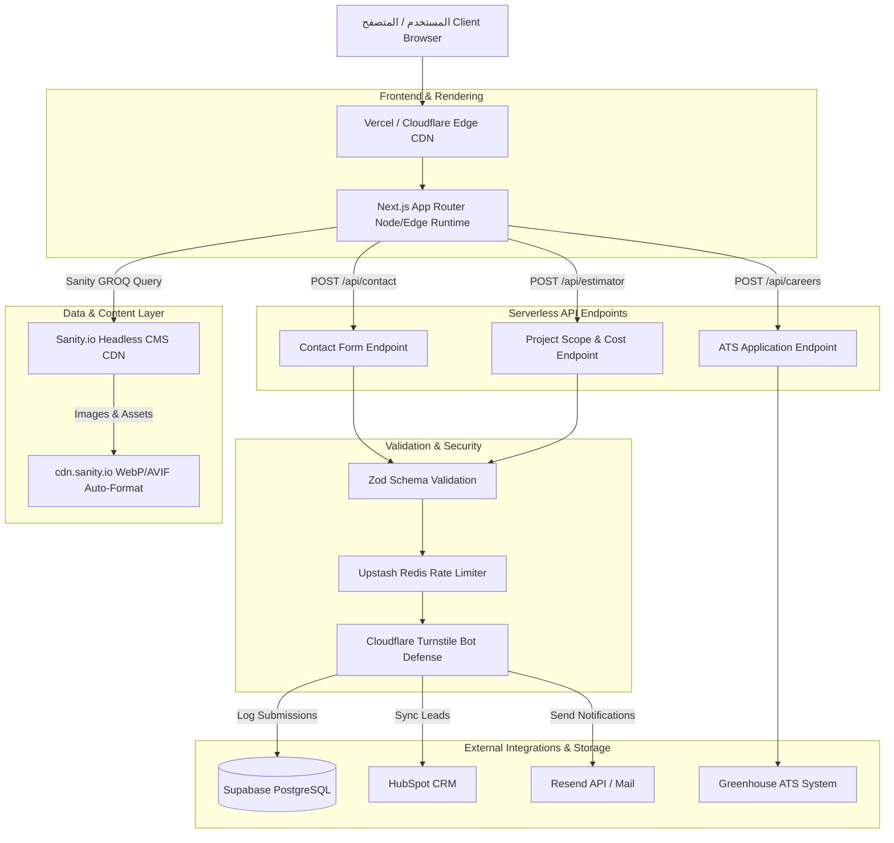

# دليل وثيقة المعمارية الفنية والمواصفات للواجهة الخلفية والبنية التحتية (Backend Technical Architecture & Infrastructure) - شركة ADI

---

## 1. الملخص التنفيذي ومعمارية البنية التحتية (Executive Summary & System Architecture)

تعتمد البنية التحتية والواجهة الخلفية لموقع شركة **ADI** للخدمات الرقمية وتطوير التطبيقات (سطح المكتب، الجوال، الويب، والحلول التقنية) على نمط **Serverless & Headless Hybrid Architecture** التكيفي المقتبس من أحدث معايير التقرير الفني لموقع MetaLab (`metalab_site_analysis_report.md`).

تهدف هذه البنية إلى تحقيق:
* **زمن استجابة فائق (Low Latency / TTFB < 50ms):** توزيع التقديم والمعالجة على شبكات الحافة السحابية (Edge Network).
* **إدارة محتوى مرنة بدون خادم (Headless CMS):** استخدام Sanity.io لإدارة المشاريع والخدمات والأخبار بشكل ديناميكي كامل.
* **أمان عالي ومعالجة مؤمنة للنماذج:** حماية endpoints من النطاقات الضارة والـ Spam مع التكامل المباشر مع أنظمة الـ CRM وبوابات التوظيف.

---

## 2. حزمة التقنيات للواجهة الخلفية (Backend & Infrastructure Tech Stack)

| الطبقة / المكون | التقنية المعتمدة | الدور والوظيفة الفنية |
| :--- | :--- | :--- |
| **نظام إدارة المحتوى (Headless CMS)** | **Sanity.io** | إدارة البيانات والمحتوى الديناميكي (المشاريع، الخدمات، المقالات، فريق العمل) مع توفير CDN عالمي مخصص. |
| **طبقة واجهة البرمجة (API Layer)** | **Next.js Serverless API Routes / Node.js** | كتابة ومعالجة endpoints الخاصة بنماذج التواصل، حاسبة المشاريع، والتوظيف. |
| **قاعدة البيانات المؤقتة والرسائل (DB & Cache)** | **Supabase (PostgreSQL) + Upstash Redis** | تخزين سجلات طلبات التقديم وحاسبة التكلفة، وتطبيق Rate Limiting لمنع الهجمات. |
| **التحقق من البيانات والأمان (Validation & Safety)** | **Zod + Cloudflare Turnstile** | فحص وحماية البيانات المدخلة في النماذج وتصفيتها قبل إرسالها للأنظمة الداخلية. |
| **بوابة التوظيف (ATS Integration)** | **Greenhouse ATS / Lever API** | ربط الوظائف المتاحة واستقبال السير الذاتية مباشرة مع أنظمة الموارد البشرية. |
| **نظام البريد التفاعلي (Email & CRM)** | **Resend / SendGrid + HubSpot API** | توجيه طلبات العملاء وحاسبة التكلفة فوراً إلى نظام إدارة العملاء وإرسال تأكيدات بريدية تلقائية. |
| **الاستضافة وشبكة توزيع المحتوى (Hosting & CDN)** | **Vercel Enterprise / Cloudflare Edge Network** | تقديم الإجابة الأولية المباشرة مع شهادات أمان SSL/TLS حماية من هجمات DDoS. |

---

## 3. مخطط معمارية النظام الخلفي (Backend & Cloud Architecture Diagram)



---

## 4. تصميم نماذج البيانات لمجلس المحتوى Sanity (Headless CMS Content Schemas)

### أ. مخطط مشروع (Project Schema - `/work`)
```typescript
export const projectSchema = {
  name: 'project',
  title: 'المشاريع (Case Studies)',
  type: 'document',
  fields: [
    { name: 'title', title: 'اسم المشروع', type: 'string' },
    { name: 'slug', title: 'رابط المشروع Slug', type: 'slug', options: { source: 'title' } },
    { name: 'category', title: 'تصنيف الخدمة', type: 'string', options: { list: ['Desktop App', 'Mobile App', 'Web Platform', 'Tech Solution'] } },
    { name: 'client', title: 'اسم العميل', type: 'string' },
    { name: 'heroImage', title: 'صورة الغلاف الرئسية', type: 'image', options: { hotspot: true } },
    { name: 'previewVideo', title: 'فيديو المعاينة المباشرة (Hover Preview)', type: 'file' },
    { name: 'summary', title: 'ملخص المشروع', type: 'text' },
    { name: 'techStack', title: 'التقنيات المستخدمة', type: 'array', of: [{ type: 'string' }] },
    { name: 'results', title: 'نتائج وأرقام النجاح', type: 'array', of: [{ type: 'object', fields: [{ name: 'metric', type: 'string' }, { name: 'value', type: 'string' }] }] },
    { name: 'content', title: 'التفاصيل والشرح الشامل', type: 'array', of: [{ type: 'block' }, { type: 'image' }] },
  ]
}
```

### ب. مخطط الخدمة (Service Schema - `/services`)
```typescript
export const serviceSchema = {
  name: 'service',
  title: 'خدمات ADI الرقمية',
  type: 'document',
  fields: [
    { name: 'title', title: 'اسم الخدمة', type: 'string' }, // Desktop, Mobile, Web, Tech Solutions
    { name: 'slug', title: 'الرابط الفرعي', type: 'slug' },
    { name: 'icon3D', title: 'اسم المكون 3D المخصص', type: 'string' },
    { name: 'description', title: 'الوصف التنفيذي', type: 'text' },
    { name: 'capabilities', title: 'القدرات والمميزات التفصيلية', type: 'array', of: [{ type: 'string' }] },
  ]
}
```

---

## 5. التفاصيل الفنية للـ Serverless API Routes

### أ. مسار حاسبة تكلفة وتفاصيل المشروع (`/api/estimator`)
* **الوظيفة:** استقبال الخيارات المحددة من نموذج التواصل متعدد الخطوات في الواجهة الأمامية، حساب تقدير التكلفة والإطار الزمني بناءً على القواعد المحددة، ثم إرسال ملخص تنفيذي للعميل وللإدارة.
* **التحقق (Validation Schema via Zod):**
```typescript
import { z } from 'zod';

export const EstimatorInputSchema = z.object({
  serviceType: z.enum(['desktop', 'mobile', 'web', 'tech_solution']),
  projectScope: z.enum(['mvp', 'full_product', 'enterprise']),
  featuresNeeded: z.array(z.string()),
  budgetRange: z.string(),
  timeline: z.string(),
  clientName: z.string().min(2),
  clientEmail: z.string().email(),
  companyName: z.string().optional(),
  projectDetails: z.string().min(10),
  turnstileToken: z.string(),
});
```

* **التدفق الفني للـ Endpoint:**
  1. التحقق من صحة `turnstileToken` مع سيرفر Cloudflare للتأكد من عدم وجود Bot.
  2. التحقق من الـ Rate Limit عبر `Upstash Redis` (حد أقصى 5 طلبات لكل عنوان IP كل ساعة).
  3. مطابقة البيانات المدخلة مع جدول التقديرات وتوليد كود المرجعية (Reference Code).
  4. حفظ نسخة من الطلب في قاعدة البيانات `Supabase`.
  5. إرسال إشعار فوري لـ HubSpot CRM ولبريد فريق المبيعات عبر `Resend API`.
  6. إرجاع استجابة JSON سريعة تحتوي على رمز التقدير والرسالة الترحيبية للواجهة الأمامية.

---

## 6. الأمن، التخزين المؤقت والبنية التحتية (Security, Caching & Infrastructure)

1. **إدارة رأس الأمان (Security Headers & CORS):**
   * تطبيق `Content-Security-Policy (CSP)` لحظر تشغيل أية سكريبتات خارجية غير مصرح بها.
   * ضبط `Strict-Transport-Security (HSTS)` و `X-Frame-Options: DENY`.

2. **التخزين المؤقت وإعادة التجديد (ISR & Caching Strategy):**
   * استخدام ميزة Next.js Incremental Static Regeneration (ISR) مع Sanity Webhooks. عند تحديث أي مشروع أو مقال في Sanity CMS، يتم إرسال Webhook لإعادة تجديد الصفحة المحددة تلقائياً (`revalidatePath('/work')`) دون الحاجة لإعادة بناء الموقع كاملاً.

3. **حماية الموارد وتجنب مشاكل التحميل المسبق (QA Fix implementation):**
   * ضبط معايير `Cache-Control: public, max-age=31536000, immutable` لجميع الأصول الثابتة والصور المقدمة من CDN.
   * إزالة استدعاءات `preload` غير الضرورية في السيرفر لضمان خلو سجلات الكونسول من تحذيرات Preload Warning المرصودة في تقرير MetaLab.
