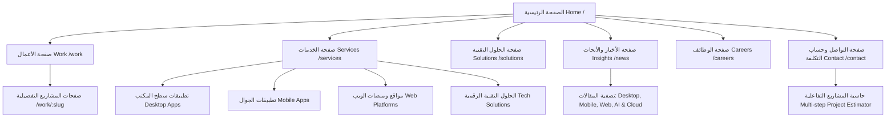

# دليل وثيقة المعمارية الفنية والمواصفات للواجهة الأمامية (Frontend Technical Architecture & Specifications) - شركة ADI

---

## 1. الملخص التنفيذي والهوية التفاعلية (Executive Summary & Visual Identity)

شركة **ADI** هي شركة متخصصة في تقديم **الخدمات الرقمية الشاملة**، وتطوير **تطبيقات سطح المكتب (Desktop Apps)**، **تطبيقات الجوال (Mobile Apps)**، **المواقع والمنصات الإلكترونية (Web Apps)**، وتقديم **الحلول التقنية المتكاملة (Enterprise Tech Solutions)**.

تقتبس الواجهة الأمامية لموقع ADI الفلسفة التصميمية والتفاعلية المستوحاة من تقرير MetaLab (`metalab_site_analysis_report.md`)، والتي تعتمد على:
* **التصميم الفاخر المظلم أولاً (Dark-First Approach):** لون أساسي فاخر داكن (`#0A0A0C` / `#0D0E12`) يعزز التباين وتألق الأشكال ثلاثية الأبعاد ودرجات التدرج الجمالية (Accents).
* **التفاعل ثلاثي الأبعاد المتقدم (Interactive WebGL 3D):** استخدام Three.js و React Three Fiber لعرض مجسمات وجسيمات تفاعلية تمثل التخصصات الرقمية لشركة ADI.
* **الحركة السلسة الموجهة بالتمرير (Scroll-Driven & Physics-Based Animations):** دمج مكتبات Lenis و Framer Motion و GSAP ScrollTrigger للتحكم في التثبيت الذكي للقطاعات وتأثيرات الانزلاق بدون تقطيع (60 FPS).

---

## 2. حزمة التقنيات للواجهة الأمامية (Frontend Tech Stack)

| الطبقة / المكون | التقنية المعتمدة | الدور والوظيفة الفنية |
| :--- | :--- | :--- |
| **إطار العمل (Framework)** | **Next.js 14+ (App Router) + TypeScript** | دعم SSR/SSG/ISR، الترقيم وتجهيز الصفحات سريعا كـ Single Page Application مع دعم أداء محركات البحث SEO. |
| **المحرك ثلاثي الأبعاد (3D WebGL)** | **Three.js + React Three Fiber (R3F) + @react-three/drei** | بناء البيئات والمجسمات التفاعلية 3D التي تتفاعل مع حركة الماوس والتمرير. |
| **محرك الفيزياء 3D (Physics)** | **@react-three/rapier** | محاكاة الفيزياء، التصادم والسحب والرمي للكرات والمجسمات في صفحة الخدمات والتوظيف. |
| **محرك الحركة والأنيميشن (Animations)** | **Framer Motion + GSAP (ScrollTrigger)** | تحريك العناصر النصية، البطاقات، الانتقالات بين الصفحات، وتثبيت القطاعات (Pinned Scrolling). |
| **التمرير الناعم (Smooth Scroll)** | **Lenis (by Studio Freight)** | إلغاء التمرير الحاد الافتراضي واستبداله بتمرير ناعم وانسيابي جداً يماثل موقع MetaLab. |
| **نظام التنسيق والسمات (Styling & Themes)** | **Tailwind CSS + CSS Modules + CSS Variables** | نظام ألوان متكيف يعتمد المتغيرات الديناميكية لدعم المظهر الداكن/الفاتح وتجنب تلوث الكلاسات. |
| **المؤشر المخصص (Custom Cursor)** | **Custom Cursor React Component + Framer Motion** | مؤشر تفاعلي يتكيف ديناميكياً مع نوع الخدمة أو العنصر الممرر عليه (`Drag`, `Hover`, `View Case Study`, `Play Demo`). |

---

## 3. هيكلية صفحات الواجهة الأمامية (Site Architecture & Page Routing)



---

## 4. التفاصيل الفنية للمكونات الرئيسية (Frontend Core Components)

### أ. الهيدر العائم الزجاجي (Floating Glassmorphism Header)
* **المكون:** `<FloatingHeader />`
* **السلوك الفني:**
  * يظل شفافاً في أعلى الصفحة، وعند التمرير لأسفل يتكثف ليصبح كبسولة عائمة زجاجية (`backdrop-blur-md` مع خلفية `rgba(10, 10, 12, 0.75)`).
  * يحتوي على:
    1. شعار شركة ADI بلمسة تفاعلية 3D/Vector.
    2. التوقيت المحلي الحي لمكاتب ADI الرئيسية (مثال: `Riyadh 11:45 AM` | `Dubai 12:45 PM`).
    3. زر تبديل السمة السريع `<ThemeToggle />` بدون أي فلاش بصري (No FOUC via CSS custom attributes).
    4. زر الإجراء المباشر `Get in Touch` الذي يوجه لنموذج التواصل.

### ب. قسم الهيرو والمجسمات التفاعلية 3D (Hero 3D Canvas Section)
* **المكون:** `<HeroCanvas3D />`
* **السلوك الفني:**
  * مجسم ثلاثي الأبعاد تفاعلي يرمز للربط الرقمي (Digital Synergy) يجمع بين عناصر رمزية لتطبيقات سطح المكتب، الجوال، والويب.
  * يتفاعل مع حركة مؤشر الماوس (Parallax Tilt) ويدعم خاصية الإضاءة الديناميكية (Dynamic Metallic Shaders & Environment Maps).

### ج. بطاقات المشاريع مع معاينات الفيديو المباشرة (Work Showcase & Video Hover)
* **المكون:** `<ProjectCard />`
* **السلوك الفني:**
  * عند المرور (Hover) فوق بطاقة أي مشروع من مشاريع ADI، يتم تشغيل مقطع فيديو توضيحي سريع بدون صوت بحجم مضغوط (`video/mp4` / `WebM`) مع خاصية `muted loop playsinline`.
  * تغيير المؤشر المخصص فوراً إلى كبسولة ناطقة: `View Case Study`.

### د. حاسبة تكلفة المشاريع التفاعلية (Multi-step Interactive Estimator)
* **المكون:** `<ProjectEstimatorForm />` في صفحة `/contact`
* **السلوك الفني:**
  * نموذج تفاعلي مقسم إلى 4 خطوات:
    1. **نوع الخدمة المطلوبة:** (Desktop App / Mobile App / Web Platform / Custom Tech Solution).
    2. **نطاق المشروع وحجمه:** (MVP / Full Product / Enterprise Upgrade).
    3. **الميزانية والإطار الزمني المتوقع.**
    4. **بيانات التواصل وتفاصيل المشروع.**
  * حساب شريط التقدم التفاعلي والانتقال بين الخطوات باستخدام `Framer Motion AnimatePresence`.

---

## 5. هيكلية المجلدات والشفرة المصدريّة (Frontend Directory Tree)

```text
src/
├── app/                        # Next.js App Router Structure
│   ├── layout.tsx              # Root Layout (Providers, Lenis Smooth Scroll, Global Header/Footer)
│   ├── page.tsx                # Home Page (Hero 3D, Stats, Work Preview, Services)
│   ├── services/
│   │   ├── page.tsx            # Overview of ADI Services
│   │   ├── desktop-apps/       # Desktop Applications Detail Page
│   │   ├── mobile-apps/        # Mobile Applications Detail Page
│   │   ├── web-development/    # Web Development Detail Page
│   │   └── tech-solutions/     # Enterprise Solutions Detail Page
│   ├── work/
│   │   ├── page.tsx            # Projects Directory & Filters
│   │   └── [slug]/page.tsx     # Dynamic Case Study Page
│   ├── news/
│   │   ├── page.tsx            # Filterable Insights & Articles
│   │   └── [slug]/page.tsx     # Single News Article
│   ├── careers/page.tsx        # Careers & Interactive Physics Canvas
│   └── contact/page.tsx        # Contact & Multi-step Estimator Form
├── components/
│   ├── ui/                     # UI Primitives (Buttons, Cards, Inputs, Modals)
│   ├── layout/                 # FloatingHeader, Footer, Navigation, ThemeToggle
│   ├── 3d/                     # HeroCanvas, FloatingNodes, FurryBallsPhysics, SceneContainer
│   ├── cursor/                 # CustomCursor, DynamicBadge
│   └── estimator/              # EstimatorStep1, EstimatorStep2, EstimatorStep3, SummaryStep
├── hooks/                      # Custom React Hooks (useSmoothScroll, useMousePosition, useTheme)
├── lib/                        # Client Utilities (Sanity Client, Framer Variants, Constants)
├── styles/
│   ├── globals.css             # Base Styles & Utility Classes
│   ├── variables.css           # Light/Dark CSS Custom Properties
│   └── lenis.css               # Smooth Scroll Rules
└── types/                      # TypeScript Interface Definitions (Project, Service, Article)
```

---

## 6. قواعد الأداء والجودة للواجهة الأمامية (Performance & QA Standards)

1. **معدل الإطارات (Target Frame Rate):** الحفاظ على 60 FPS ثابتة لكافة المشاهد 3D والانتقالات البصرية.
2. **تحسين تحميل الأصول (Asset Optimization):**
   * استخدام تنسيقات `WebP` و `AVIF` لجميع الصور المعروضة.
   * ضبط خاصية `preload` المباشرة فقط للموارد الأساسية التي تُستخدم في الثواني الأولى لتجنب تحذيرات الكونسول المرصودة في التقرير.
3. **تحميل الخفيف للمكونات (Lazy Loading & Code Splitting):**
   * تحميل مكونات WebGL/Three.js باستخدام `next/dynamic` مع خاصية `{ ssr: false }` لمنع بطء التقديم الأولي.
4. **التكيف التام مع الشاشات (Responsive Design & Mobile Fallbacks):**
   * في شاشات الجوال الصغيرة، يتم تبسيط مجسمات Canvas 3D تلقائياً لتقليل استهلاك المعالج والبطارية مع الحفاظ على الأسلوب البصري الفاخر.
