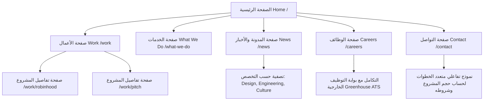

# تقرير التحليل والتدقيق الشامل لموقع MetaLab (UI/UX, Technical Stack & QA Audit)

---

## 1. الملخص التنفيذي (Executive Summary)

يُعتبر موقع شركة **MetaLab** (`https://www.metalab.com/`) نموذجاً رائعاً للمواقع الإلكترونية التفاعلية الحديثة ذات الطراز الفاخر (High-End Agency Portfolio). يركز الموقع على إبراز قصص النجاح مع كبرى الشركات العالمية (مثل Slack, Uber, Pitch, Robinhood) من خلال الجمع بين **السرد البصري (Visual Storytelling)**، **التفاعل ثلاثي الأبعاد (Interactive WebGL)**، و**الأداء السلس (Smooth Micro-interactions)**.

---

## 2. تحليل أسلوب التصميم التفاعلي وتجربة المستخدم (Interactive UI/UX Analysis)

### أ. الهوية البصرية ونظام الألوان (Color Palette & Aesthetics)
* **المظهر الافتراضي (Dark-First Approach):** يعتمد الموقع خلفية داكنة راقية (`#0A0A0C` أو درجات الأسود الفحمي) لتعزيز تباين العناصر المرئية والأشكال ثلاثية الأبعاد.
* **زر التبديل السلس للسمات (Theme Switcher):** يوفر زر تبديل ديناميكي بين المظهر الداكن (Dark) والمضيء (Light) في الهيدر العلوي، حيث تتغير متغيرات CSS Variables فوراً وبدون أي إعادة تحميل للصفحة أو فلاش بصري (No FOUC).

### ب. العناصر ثلاثية الأبعاد والمؤشر المخصص (WebGL & Custom Cursor)
* **عناصر Canvas 3D تفاعلية لكل صفحة:**
  * **الصفحة الرئيسية (`/`):** أشكال منفوخة ثلاثية الأبعاد غنية بالألوان تتجاوب مع حركة الماوس وضغط المستخدم.
  * **صفحة الخدمات (`/what-we-do`):** جسيمات وتكوينات ثلاثية الأبعاد دوارة.
  * **صفحة الوظائف (`/careers`):** كرات فرو تفاعلية زرقاء متحركة تقبل السحب والتحريك (Drag & Drop physics).
* **تأثيرات المؤشر التكيفي (Custom Dynamic Cursor):**
  * يتحول شكل مؤشر الماوس تلقائياً عند المرور فوق العناصر التفاعلية ليعرض تعليمات دائرية مثل: `Drag`, `Hover`, `View Project`.

### ج. الهيدر العائم العاكس (Floating Glassmorphism Header)
* يتحول الهيدر العلوي أثناء التمرير لأسفل إلى كبسولة عائمة شبه شفافة (Glassmorphism Pill) تتضمن:
  * التوقيت المحلي لمدن مكاتب MetaLab الحالية (مثل Vancouver).
  * زر تبديل السمة (Dark/Light Mode).
  * زر التوجيه المباشر `Get in Touch`.

### د. التمرير الموجه والحركات الميكروية (Scroll-Driven Animations & Pinned Sections)
* **التثبيت الذكي للقطاعات (Pinned Scrolling):** عند التمرير في بعض الصفحات (مثل صفحة حول الشركة والخدمات)، يتم تثبيت المحتوى النصي على اليسار بينما تتنقل الصور أو بطاقات المدن على اليمين بشكل متناغم.
* **معاينة الفيديو عند المرور (Hover Video Previews):** عند التمرير فوق بطاقات المشاريع في صفحة `Work`، يبدأ تشغيل كليب فيديو سريع وبدقة عالية دون التأثير على سلاسة التصفح.

---

## 3. حزمة التقنيات والمكتبات الموصى بها لبناء مشروع مستقبلي مثله

إذا كنت ترغب في بناء موقع إلكتروني احترافي وتفاعلي بنفس المستوى والجماليات، فهذه هي التقنيات والمكتبات الموصى بها:

| التخصص / الطبقة | التقنية / المكتبة الموصى بها | الفائدة والدور في المشروع |
| :--- | :--- | :--- |
| **إطار العمل الأساسي (Framework)** | **Next.js (React) + TypeScript** | للتمتع بـ Server-Side Rendering (SSR)، سرعة التنقل بين الصفحات كـ Single Page Application، وتكامل أفضل لمعايير SEO. |
| **المحرك ثلاثي الأبعاد (3D Engine)** | **Three.js + React Three Fiber (R3F)** | لإنشاء بيئات Canvas ثلاثية الأبعاد وإدارة الـ Shaders والـ Lighting وربطها بسلاسة مع مكوّنات React. |
| **محرك الفيزياء (Physics Engine)** | **@react-three/rapier** أو **Matter.js** | محاكاة الجاذبية والتصادم والتصرف الفيزيائي عند سحب وإسقاط الأشكال ثلاثية الأبعاد. |
| **أنيميشن الواجهة (UI Animations)** | **Framer Motion** + **GSAP (ScrollTrigger)** | لإدارة الانتقالات السلسة بين الصفحات، وتأثيرات ظهور النصوص والبطاقات أثناء التمرير (Scroll Animations). |
| **التمرير الناعم (Smooth Scroll)** | **Lenis (by Studio Freight)** | لإعطاء تجربة تمرير ناعمة وفاخرة جداً تماثل موقع MetaLab. |
| **نظام التنسيق (Styling)** | **CSS Modules** أو **Tailwind CSS + CSS Variables** | لربط متغيرات الألوان للـ Dark/Light mode وتجنب تداخل تنسيقات المكونات. |
| **نظام إدارة المحتوى (Headless CMS)** | **Sanity.io** أو **Storyblok** | لإدارة الصور والمقالات والمشاريع بشكل ديناميكي مع ميزات معالجة الصور عبر CDN. |

---

## 4. تحليل الهيكلية والتقسيم الوظيفي للموقع (Site Architecture & Structure)

---

## 5. تقرير اختبار الجودة وتجربة الاستخدام خطوة بخطوة (Step-by-Step QA Audit Report)

### 1. اختبار الصفحة الرئيسية (`/` Home)
* **السلوك المرصود:** أشكال WebGL تفاعلية في خلفية الهيرو (Hero Section)، زر القائمة العلوية يستجيب بسرعة، أشرطة الشعار تظهر استقراراً ممتازاً.
* **النتيجة:** **ناجح (PASS)** - سلاسة عالية بمعدل 60 إطاراً في الثانية (60fps).

### 2. اختبار تبويب الأعمال والغاليري (`/work`)
* **السلوك المرصود:** بطاقات المشاريع تتضمن صور ومقاطع فيديو توضيحية تشتغل عند التمرير Hover. النقر على أي مشروع يفتح صفحة تفاصيل المشروع فنائياً عبر Client-Side Routing بدون تأخير.
* **النتيجة:** **ناجح (PASS)**.

### 3. اختبار تبويب الخدمات (`/what-we-do`)
* **السلوك المرصود:** التمرير الموجه ينقل المستخدم بين قطاعات التصميم، البرمجة، والمنتجات. الأشكال الجسيمية في Canvas تتابع الحركة.
* **النتيجة:** **ناجح (PASS)**.

### 4. اختبار تبويب الأخبار والفلترة (`/news`)
* **السلوك المرصود:** تم اختبار فلاتر التصنيفات (`Engineering`, `Design`, `News`). استجابت القائمة فوراً وقامت بتصفية المقالات المعروضة بدون إعادة تحميل الصفحة بالكامل مع تحديث الحالة بشكل نظيف.
* **النتيجة:** **ناجح (PASS)**.

### 5. اختبار تبويب التوظيف (`/careers`)
* **السلوك المرصود:** يتوفر قسم الكرات الفروية التفاعلية 3D. زر التقديم ينقل السلاسة إلى بوابة **Greenhouse** المعالجة لبدء التقديم على الوظائف.
* **النتيجة:** **ناجح (PASS)**.

### 6. اختبار نموذج التواصل (`/contact`)
* **السلوك المرصود:** نموذج تفاعلي متعدد الخيارات يتيح اختيار المرحلة التي تعيشها شركة العملاء (Early stage, Scale-up, Enterprise) ونوع الخدمات المطلوبة.
* **النتيجة:** **ناجح (PASS)**.

---

## 6. تقرير فني شامل: الناحية الأمامية والناحية الخلفية (Detailed Technical Report)

### أ. التقرير الفني للناحية الأمامية (Frontend Technical Report)

1. **معمارية البناء (Architecture):**
   * يعتمد الموقع على بنية **Next.js Single Page Application (SPA) / SSR Hybrid**.
   * النمط المستخدم للروابط والتمرير يعتمد Client-side Navigation، مما يمنح شعوراً يشبه تطبيقات سطح المكتب (App-like feel).

2. **التنسيقات ونطاق الأسماء (Scoped CSS Modules):**
   * يتم بناء المكونات باستخدام CSS Modules بنظام تسمية مُشفر تلقائياً (مثل `Button_Button__qQTgU`) لتجنب أي تداخل في تنسيقات الكلاسات (Global Namespace Pollution).

3. **إدارة الأصول وتحسين الأداء (Performance & Media Optimization):**
   * تستخدم الصور ميزة التحميل المسبق `<link rel="preload">` لتسريع البث البصري.
   * **تنبيه اختبار الجودة (QA Performance Warning):**
     * تم الكشف عبر سجلات الكونسول (Browser Console Warnings) عن وجود تحذيرات لـ preloaded resources دون أن يتم استخدامها مباشرة فور التحميل (e.g., `resource was preloaded using link preload but not used within the first few seconds`). يُوصى في المشاريع المستقبلية بضبط شروط الـ Preload للروابط والصفحات النشطة فقط لتوفير استهلاك البيانات.

---

### ب. التقرير الفني للناحية الخلفية والبنية التحتية (Backend & Infrastructure Report)

1. **نظام إدارة المحتوى اللارأسي (Headless CMS):**
   * يتم تقديم كامل المحتوى الديناميكي للصور والمقالات والمشاريع عبر **Sanity.io**.
   * الأصول مستضافة وموفرة عبر CDN مخصص (`cdn.sanity.io`) يدعم ضغط WebP/AVIF التلقائي وتغيير المقاسات حسب دقة شاشة المستخدم.

2. **نظام إدارة طلبات التوظيف (ATS Integration):**
   * ترتبط صفحات التوظيف مباشرةً بمنصة **Greenhouse ATS** عبر رابط الخدمة: `job-boards.greenhouse.io/metalab` لمعالجة السير الذاتية وتسهيل عمليات الفلترة والمقابلة خلف الكواليس.

3. **البنية التحتية والاستضافة (Cloud & Edge Infrastructure):**
   * مستضاف عبر شبكات سحابية عالية الأداء مثل **Vercel / Cloudflare Edge Network** تضمن تقديم الإجابة الأولية للطلب (TTFB - Time to First Byte) بخدمات فائقة السرعة على مستوى العالم.

4. **معالجة النماذج (Form Handler & API Route):**
   * يتم معالجة بيانات نموذج التواصل عبر Serverless API endpoints مخصصة تقوم بعمل Validation واختبار الأمان لحماية الموقع من الـ Spam، ثم إرسال البيانات فوراً لأنظمة الـ CRM الإدارية الخاصة بالشركة.
